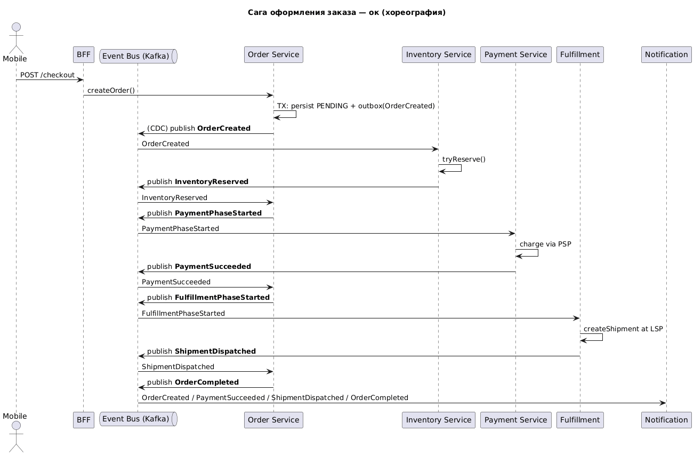
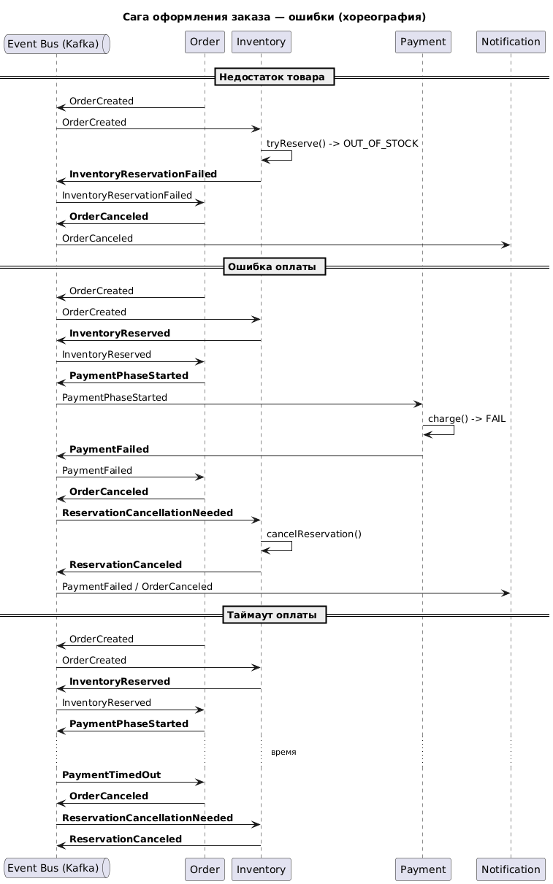

# NovaMarket Marketplace – Архитектура: История Заказов и Сага Оформления

Данный раздел содержит архитектурные материалы, описывающие компонент **сагу оформления заказа** в системе NovaMarket Marketplace.

## Структура

- [`c2.puml`](./results/c2.puml) — PlantUML-диаграмма (C4-контейнер), показывающая общую архитектуру NovaMarket Marketplace.
- [`saga-events.md`](./results/saga-events.md) — Реестр событий, участвующих в саге оформления заказа.
- [`sequence-ok.puml`](./results/sequence-ok.puml) — PlantUML-диаграмма последовательности (Sequence Diagram), показывающая успешный сценарий оформления заказа.
- [`sequence-fail.puml`](./results/sequence-fail.puml) — PlantUML-диаграмма последовательности, показывающая сценарии обработки ошибок при оформлении заказа.

## Описание

Решение описывает архитектурные аспекты, связанные с оформлением заказа и историей заказов в **NovaMarket Marketplace**. 
Он включает в себя общую структуру системы, сагу бизнес-процесса оформления заказа, а также события, участвующие в этой саге, и её различные сценарии (успешное выполнение, ошибки).

### Основные компоненты

- **Mobile BFF**: Точка входа для мобильных клиентов, обработка запросов, авторизация.
- **Order Service**: Центральный сервис, управляющий жизненным циклом заказа, координирующий сагу оформления заказа через события.
- **Inventory Service**: Управление остатками и резервирование товаров.
- **Payment Service**: Обработка платежей через внешние платёжные шлюзы (PSP).
- **Fulfillment Service**: Интеграция с логистическими провайдерами для доставки.
- **Order History Query Service**: Сервис, отвечающий за предоставление данных истории заказов пользователю (описан подробнее в отдельном README).
- **Event Bus (Kafka)**: Шина сообщений, обеспечивающая асинхронное взаимодействие между сервисами через события.
- **Notification Service**: Отправка уведомлений пользователям.
- **Внешние системы**: Платёжные шлюзы (PSP), логистические провайдеры, провайдеры уведомлений.

## Диаграммы

[`sequence-ok.puml`](./results/sequence-ok.puml) и [`sequence-fail.puml`](./results/sequence-fail.puml) иллюстрируют **хореографию саги**, описанную в [`saga-events.md`](./results/saga-events.md).

