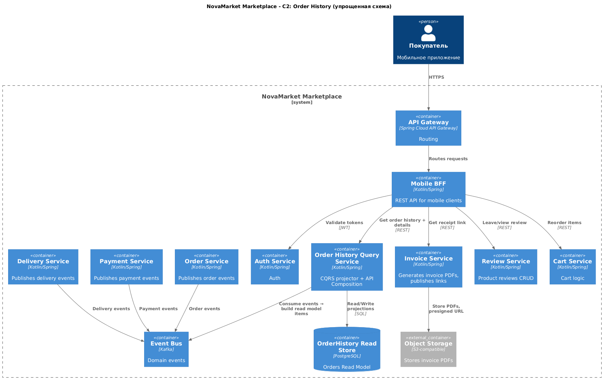

# NovaMarket Marketplace – История Заказов

Данный раздел содержит архитектурное решение для компонента **истории заказов** в системе NovaMarket Marketplace.

## Структура

- [`adr-order-history.md`](results/adr-order-history.md) — архитектурное решение (ADR), описывающее подход к реализации компонента.
- [`c2-order-history.puml`](results/c2-order-history.puml) — PlantUML-диаграмма (C4-контейнер), визуализирующая архитектурные связи.

## Описание

Решение реализует функциональность просмотра истории заказов пользователя с использованием паттернов **CQRS** и **API Composition**. Архитектура обеспечивает высокую доступность, производительность и безопасность.

### Основные компоненты

- **Mobile BFF** — точка входа для мобильного клиента, обработка JWT, пагинация.
- **Order History Query Service** — сервис, отвечающий за предоставление данных истории заказов.
- **PostgreSQL** — база данных для хранения read-модели.
- **Kafka** — шина событий для обмена информацией между сервисами.
- **Смежные сервисы** (Invoice, Review, Cart) — обеспечивают расширенный функционал (чеки, отзывы, повторный заказ).

## Требования

- Подробно описаны в [`adr-order-history.md`](results/adr-order-history.md) .
- Включают функциональные (список, детали, чек, отзывы) и нефункциональные (производительность, доступность, безопасность) требования.

## Диаграмма

