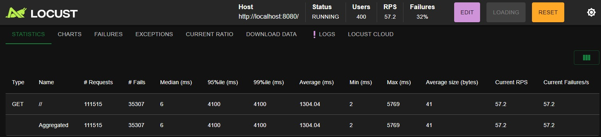
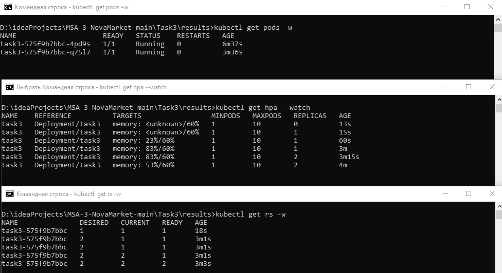
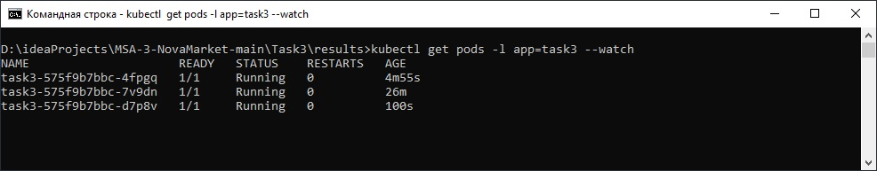
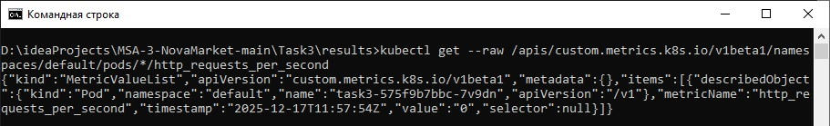
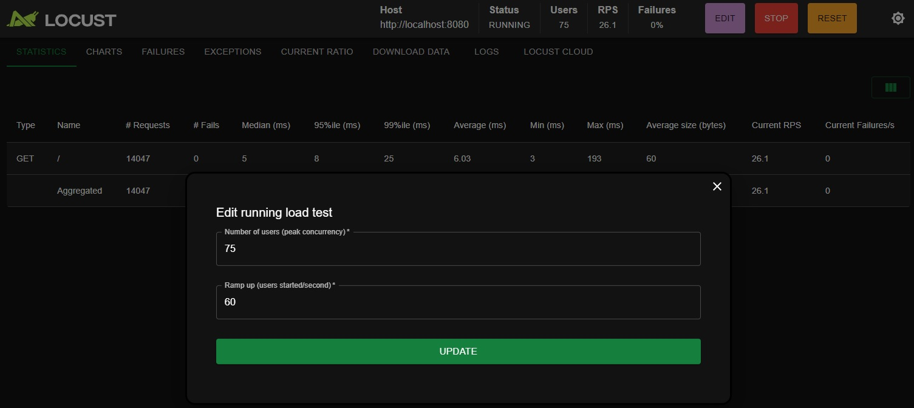
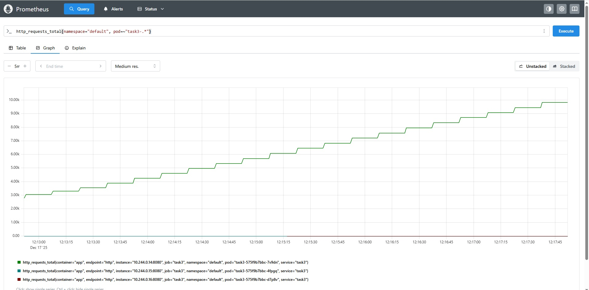
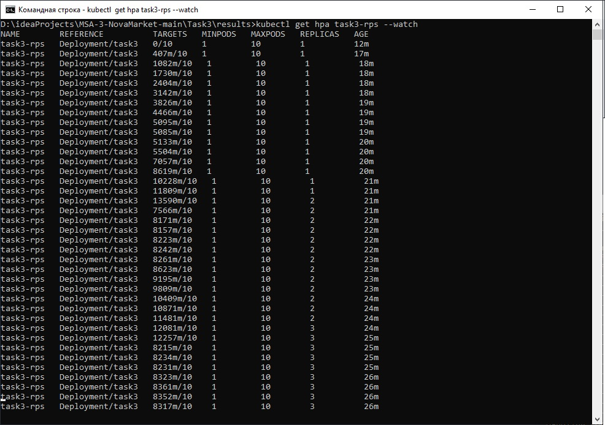

# Task3: Динамическое масштабирование приложения в Kubernetes

Эта директория содержит файлы, используемые для демонстрации и проверки концепции **динамического масштабирования** (Horizontal Pod Autoscaling - HPA) в Kubernetes.

## Структура

- `deployment.yaml` — Манифест для деплоя тестового приложения (`scaletestapp`).
- `service.yaml` — Манифест для сервиса, предоставляющего доступ к приложению и используемого Prometheus для обнаружения целей.
- `servicemonitoring.yaml` — Манифест ServiceMonitor, настраивающий Prometheus на сбор метрик с Pod'ов приложения `task3`.
- `adapter-values.yaml` — Файл значений для настройки Prometheus Adapter (определяет правило для метрики RPS).
- `hpa.yaml` — Манифест HPA, масштабирующий приложение на основе **утилизации памяти**.
- `hpa-rps.yaml` — Манифест HPA, масштабирующий приложение на основе **внешней метрики RPS** (запросов в секунду на под).
- `locustfile.py` — Сценарий для инструмента нагрузочного тестирования Locust.
- `results/screenshots/` — Директория со скриншотами, подтверждающими работу HPA.

## Описание

В рамках задания была продемонстрирована работа HPA двумя способами:

1.  **На основе утилизации памяти**: Использовался `hpa.yaml`.
2.  **На основе внешней метрики (RPS)**: Использовался `hpa-rps.yaml` совместно с Prometheus и Prometheus Adapter (настроенный через `adapter-values.yaml`).

Нагрузка на приложение генерировалась с помощью Locust (`locustfile.py`).

---------- 
## На основе утилизации памяти

1.  **Запустите Minikube и включите `metrics-server`:**

    ```bash
    minikube start --driver=docker
    minikube addons enable metrics-server
    # minikube dashboard # (опционально)
    ```

2.  **Примените манифесты:**

    ```bash
    kubectl apply -f deployment.yaml
    kubectl apply -f service.yaml
    kubectl apply -f hpa.yaml
    ```

3.  **Настройте доступ к приложению:**

    ```bash
    kubectl port-forward service/task3 8080:80
    ```

4.  **Запустите Locust** (находясь в директории с `locustfile.py`):

    ```bash
    locust
    ```
    Установите Host: `http://localhost:8080`. Number of users  `400` Hatch Rate: `60`
    
    

5.  Наблюдайте за HPA и Pod'ами

    

----------
## На основе внешней метрики (RPS)

1.  **Запустите Minikube и включите `metrics-server`:**

    ```bash
    minikube start --driver=docker
    minikube addons enable metrics-server
    # minikube dashboard # (опционально)
    ```

2.  **Настройте Helm:**

    ```bash
    helm repo add prometheus-community https://prometheus-community.github.io/helm-charts
    helm repo update
    ```

3.  **Установите `kube-prometheus-stack` и `prometheus-adapter` как отдельные релизы:**

    ```bash
    helm install prometheus prometheus-community/kube-prometheus-stack --namespace monitoring --create-namespace
    helm install prometheus-adapter prometheus-community/prometheus-adapter -f adapter-values.yaml --namespace monitoring --create-namespace
    ```

4.  **Примените манифесты приложения и ServiceMonitor:**

    ```bash
    kubectl apply -f deployment.yaml
    kubectl apply -f service.yaml
    kubectl apply -f hpa-rps.yaml
    kubectl apply -f servicemonitor.yaml
    ```
    
    

5.  **Проверьте доступность метрики:**

    ```bash
    kubectl get --raw /apis/custom.metrics.k8s.io/v1beta1/namespaces/default/pods/*/http_requests_per_second
    ```
    
    


6.  **Настройте доступ к Prometheus и приложению:**

    ```bash
    kubectl port-forward -n monitoring svc/prometheus-kube-prometheus-prometheus 9090
    kubectl port-forward service/task3 8080:80
    ```

7.  **Запустите Locust** (находясь в директории с `locustfile.py`):

    ```bash
    locust
    ```
    Установите Host: `http://localhost:8080`.

    

8.  **Проверьте метрики в Prometheus UI** (`http://localhost:9090`):
    *   В `Graph`: `http_requests_total{namespace="default", pod=~"task3-.*"}`

    

9.  **Наблюдайте за HPA и Pod'ами:**

    ```bash
    kubectl get hpa task3-rps --watch
    kubectl get pods -l app=task3 --watch
    ```

    
    